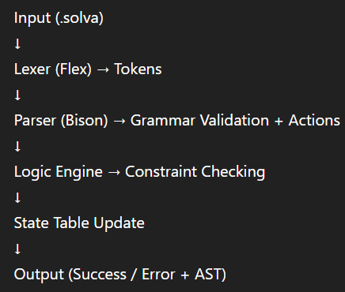
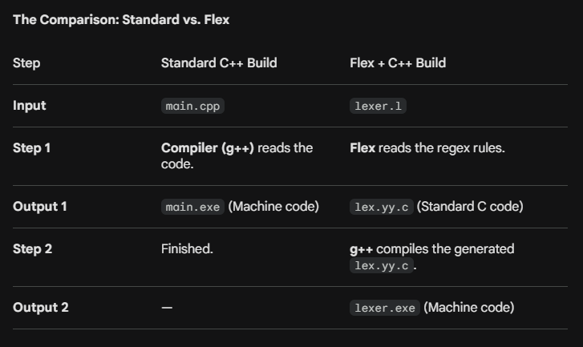

# 📘 SolvA: Syntax-Directed CSP Validator — Abstract Summary

## 🔍 Overview
SolvA is a **Domain-Specific Language (DSL)** designed to model and validate **Constraint Satisfaction Problems (CSPs)**.  
Unlike traditional compilers, SolvA integrates **logical validation directly into the parsing phase**, treating constraint violations as syntax-level errors.

---

## 🧠 Core Concept
- Combines **compilation techniques** with **constraint validation**
- Uses **Syntax-Directed Translation (SDT)** to enforce logic during parsing
- Eliminates the need for a backend execution engine
- Ensures **invalid states are rejected immediately**

---

## 🏗️ High-Level Architecture

### 📥 Input
- `.solva` file containing:
  - Variables
  - Domains
  - Constraints
  - Assignment sequence (moves)

---

### ⚙️ Processing Pipeline

#### 1. Lexical Analysis (Flex)
- Converts raw text into tokens
- Uses **Regular Expressions**
- Identifies:
  - Keywords (`var`, `constraint`)
  - Identifiers (`A`, `B`)
  - Operators (`=`, `!=`)
  - Symbols (`;`)

**Output:** Token stream

---

#### 2. Syntax Analysis (Bison)
- Validates structure using **Context-Free Grammar (CFG)**
- Matches token sequences to grammar rules
- Executes **semantic actions** on rule matches

Example:
assignment : ID '=' INT ';'

**Output:**
- Triggers validation logic
- Builds Abstract Syntax Tree (AST)

---

#### 3. Logic Engine (CSP Validator)
- Acts as the **decision-making component**
- Validates assignments against constraints
- Checks consistency with:
  - Existing assignments
  - Defined rules

**Behavior:**
- Valid move → Update state
- Invalid move → Raise error and halt

---

#### 4. State Table (Symbol Table)
- Stores variable-value mappings
- Maintains current system state
- Used for conflict detection

---

#### 5. AST Visualizer
- Converts AST into **DOT format**
- Enables graphical visualization using Graphviz

---

## 🔄 Data Flow Summary

---

## 📤 Output Behavior

### ✅ On Success
- Validation confirmation
- AST generated (`output.dot`)
- Optional visualization (`tree.png`)

### ❌ On Failure
- Immediate termination
- Syntax or logic error reported

---

## ⚡ Key Features
- Syntax-directed validation
- Immediate error detection
- Modular design
- AST visualization support
- Efficient execution (no runtime solving)

---

## 🧩 Component Breakdown

- `lexer.l` → Tokenization (Flex)
- `parser.y` → Grammar + logic triggers (Bison)
- `logic_engine.cpp` → Constraint validation
- `symbol_table.h` → State management
- `visualizer.cpp` → AST visualization

---

## 🧠 How It Works

1. Constraints are parsed and stored  
2. Assignments are processed one-by-one  
3. Each assignment is validated against constraints  
4. Invalid state → immediate termination  

---

## 🎯 Design Philosophy
- Treat logic violations as syntax errors  
- Shift validation early (during parsing)  
- Ensure correctness before completion  

---

## 🚀 Conclusion
SolvA demonstrates how compiler design principles can be extended to constraint validation problems. By embedding logic into syntax analysis, it ensures correctness, reduces complexity, and provides immediate feedback.

1. The Flex Stage (flex lexer.l)
Flex is a "Source-to-Source" translator. It reads your Regular Expressions and builds a DFA (Deterministic Finite Automaton).

Internally: It creates a massive, hard-coded integer table (a state-transition table).

The Result: It spits out a file called lex.yy.c. This file is pure C code, but it's "ugly" code—it’s designed for speed, not for humans to read. It contains a function called yylex().

 